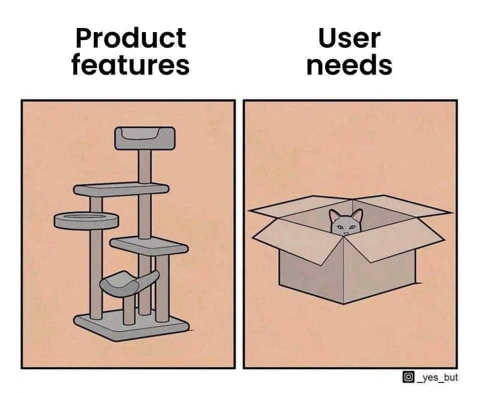

# Every client likes charts, but deployment is hard

# Every client likes charts, but deployment is hard

- I want to show some visualization to people without any prior Python or R installation
- It should be super quick to deploy without any licensing or right's request
- It should not break my programming workflow, i.e. fully automated

# Many solutions, but none is perfect (and so is mine)

> - Tableau: Licensing fees 💸 and need another data scientist to do the update/upload
> - PowerBI: of course we don't have the best feature, namely Python and R integration, and still no other data scientist to do the update/upload
> - Shiny, Dash,...: Very powerful but will take a while to figure out how to setup (how to securely expose an app)
> - other platforms: potentially client data restrictions or some complicated IT setup required
> - using Javascript framework(s): was it vue.js, node.js, angular.js, or react.js?

# Many solutions, but none is perfect (and so is mine)

> - some other way to run your workspace as server through shared folder

# My needs are simple

# My needs are simple
- Most of the time the use case requires to display a dashboard with some graphics which can be interactively engaged with, such as filtering by selection
- My goal is to create a flat html which embeds the all data and renders the visualization
- The proposed options are R packages but, surely there are some Python equivalents for certain features (as some packages are Javascript wrappers)

# For tables

- [DT](https://rstudio.github.io/DT/) (wraps DataTables library)
- [rpivotTable](https://cran.r-project.org/web/packages/rpivotTable/vignettes/rpivotTableIntroduction.html) (wraps pivottable library)

# For charts

- esquisse
- ggplotly

# For interactivity

- htmlwidget
- crosstalk

